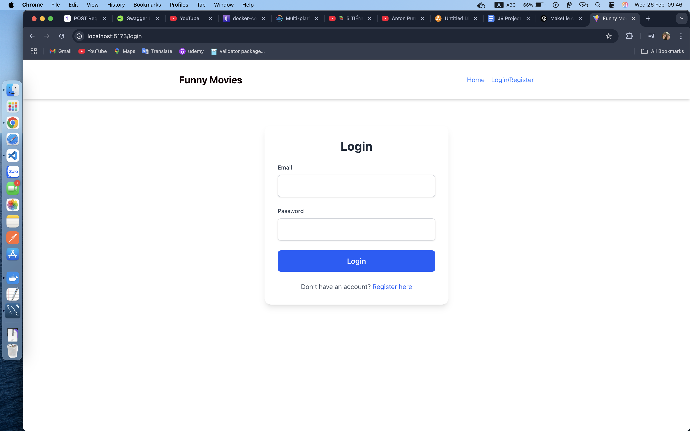
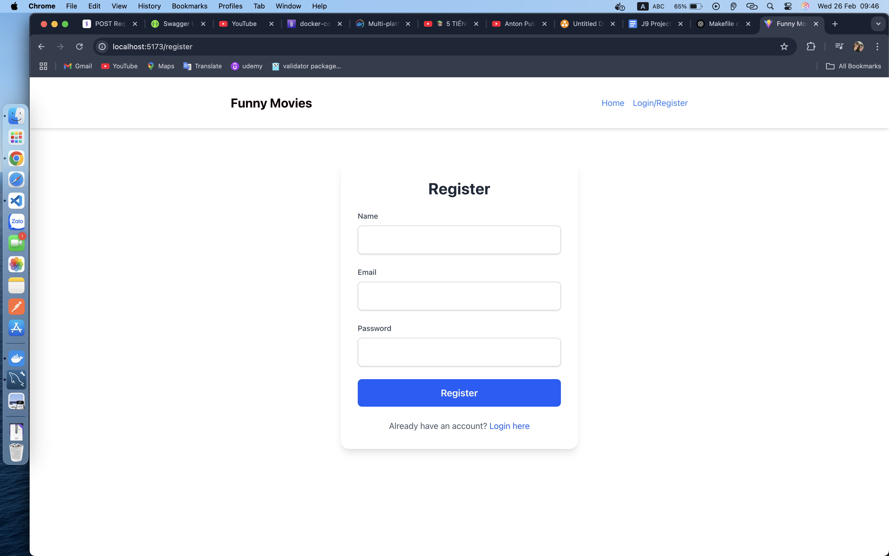
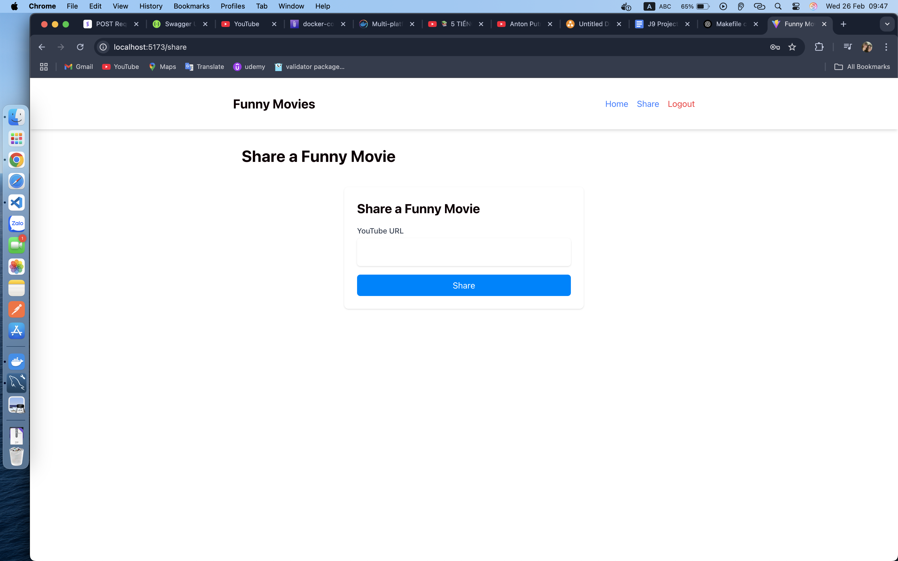
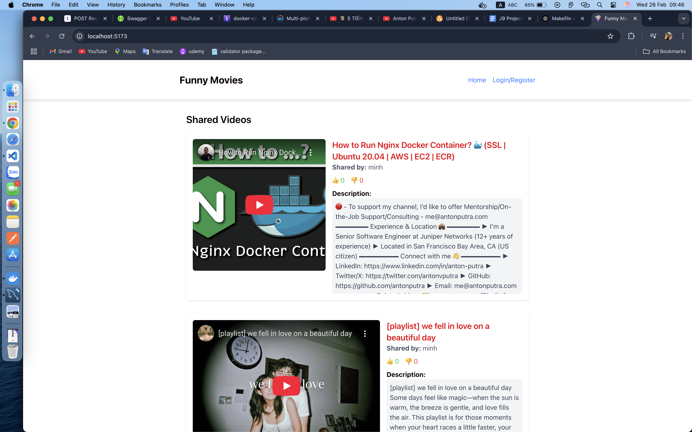

# Youtube Video Sharing App

## Introduction

**Youtube Video Sharing App** is a web application that allows users to register, log in, and share their favorite YouTube videos by simply pasting a link. Users can also browse videos shared by others and receive real-time notifications when new videos are added.

### Purpose

The purpose of this application is to create an interactive platform where users can easily share and discover YouTube videos while engaging with a real-time notification system.

## Key Features

- **User Registration & Authentication**: Users can sign up and log in using a token-based authentication system (no OAuth required).
- **Video Sharing**: Users can share YouTube video links, which will be stored and displayed in the app.
- **Video Listing**: Users can browse a list of videos shared by others.
- **Real-Time Notifications**: When a new video is shared, all logged-in users receive real-time notifications via WebSockets.

## Prerequisites

- Go v1.23.6
- Docker v27.4.0
- Docker compose v2.31.0-desktop.2
- MySQL image (mysql:8.0)
- Node v21.2.0

## System Design

### Assumptions

---

- **Total registered users**: 10,000
- **Daily Active Users (DAU)**: 5,000
- **Concurrent users**: 1,000
- **Videos shared per day**: 5,000
- **Each user shares at least 1 video per day**

---

### Estimations

---

**NOTE**: The data estimations provided below are assumptions and may vary in a real-world scenario.

- **Database Write Load**: 5,000 QPS (queries per second)
- **Database Read Load**: 100,000 QPS (assuming 20x read requests per write)
- **Average video size**: 300MB - 500MB (1080p, 10-15 minutes)
- **Estimated storage needed**:
  - **Per day**: 500MB \* 1,000 videos ≈ 488GB
  - **Per year**: 488GB \* 365 ≈ 174TB
- **Metadata Storage**:
  - **Video metadata**: ~49MB/day → ~17.5GB/year
  - **User metadata**: ~9.7MB for 10K users

---

### High-Level Architecture

---

```
FE -> Load Balancer ----> BE 1  -------   <share new video, push event to Kafka>
 |      | |         |---> BE 2  ------| -----------------------------------------> Kafka ---------------------------
 -------| |         |---> BE 3  ------|                                                                            |
 |        |                           |                                                                            |
 |        |        -------------------|                                                                            |
 |        |        |                   MySQL (Account, Video metadata, Account password) (~=17.5GB + 9.7MB)        |
 |        |        |                                                                                               |
 |--------|----->Blob Storage (video) (1 year) ~ 174TB                                                             |
          |                                                                                                        |
          ---------------------------------------------------------------------------------------------------------|
          <Background job consumes messages from Kafka, checking online users via WebSockets>
```

---

### API Design

---

#### Authentication

##### Register

- **Endpoint**: `POST /api/v1/accounts`
- **Payload**:
  ```json
  {
    "email": "string",
    "password": "string",
    "fullname": "string",
    "avatar_url": "string (optional)"
  }
  ```
- **Response**:

  ```json
  {
    "data": {
      "access_token": "string",
      "refresh_token": "string",
      "id": 0,
      "email": "string",
      "fullname": "string",
      "avatar_url": "string",
      "otp": "string"
    },
    "metadata": {
      "code": 0
    }
  }
  ```

##### Register

- **Endpoint**: `POST /api/v1/check-token`
- **Payload**:
  ```text
  Header:
    Authorization: [access-token]
  ```
  ```json
  {}
  ```
- **Response**:
  ```json
  {
    "otp": "string"
  }
  ```

##### Login

- **Endpoint**: `POST /api/v1/accounts/login`
- **Payload**:
  ```json
  {
    "email": "string",
    "password": "string"
  }
  ```
- **Response**:
  ```json
  {
    "data": {
      "access_token": "string",
      "refresh_token": "string",
      "id": 0,
      "email": "string",
      "fullname": "string",
      "avatar_url": "string",
      "otp": "string"
    },
    "metadata": {
      "code": 0
    }
  }
  ```

##### Logout

- **Endpoint**: `POST /api/v1/accounts/logout/{accountID}`
- **Response**:
  ```json
  {
    "metadata": {
      "code": 0
    }
  }
  ```

##### Refresh Token

- **Endpoint**: `POST /api/v1/accounts/refresh-token`
- **Response**:
  ```json
  {
    "data": {
      "access_token": "string",
      "refresh_token": "string"
    },
    "metadata": {
      "code": 0
    }
  }
  ```

---

#### Video Management

##### Share a Video

- **Endpoint**: `POST /api/v1/videos`
- **Payload**:
  ```json
  {
    "title": "string",
    "description": "string",
    "upvote": 0,
    "downvote": 0,
    "thumbnail": "string",
    "video_url": "string"
  }
  ```
- **Response**:
  ```json
  {
    "data": {
      "id": 0,
      "title": "string",
      "description": "string",
      "upvote": 0,
      "downvote": 0,
      "thumbnail": "string",
      "video_url": "string"
    },
    "metadata": {
      "code": 0
    }
  }
  ```

##### List Videos

- **Endpoint**: `GET /api/v1/videos`
- **Response**:
  ```json
  {
    "data": [
      {
        "id": 0,
        "title": "string",
        "description": "string",
        "upvote": 0,
        "downvote": 0,
        "thumbnail": "string",
        "video_url": "string",
        "shared_by": "string"
      }
    ],
    "metadata": {
      "code": 0,
      "pagination": {
        "page": 1,
        "limit": 10,
        "total_items": 100,
        "total_pages": 10,
        "is_next": true,
        "is_previous": false
      }
    }
  }
  ```

---

### Database Schema

---

#### Accounts Table

| Column    | Type   |
| --------- | ------ |
| id        | int    |
| email     | string |
| fullname  | string |
| avatarURL | string |

#### Account_Password Table

| Column   | Type   |
| -------- | ------ |
| id       | int    |
| password | string |

#### Videos Table

| Column      | Type   |
| ----------- | ------ |
| id          | int    |
| description | string |
| upvote      | int64  |
| downvote    | int64  |
| thumbnail   | string |
| video_url   | string |
| account_id  | int    |
| title       | string |

#### Refresh token table

| Column     | Type      |
| ---------- | --------- |
| id         | int       |
| account_id | int       |
| token      | string    |
| expires_at | timestamp |
| created_at | timestamp |
| updated_at | timestamp |

---

### Kafka Message Schema (no longer used)

---

```json
{
  "video_title": "string",
  "fullname": "string"
}
```

---

## Installation & Configuration

1. **Clone the repository:**

```sh
   git clone https://github.com/TienMinh25/ytb-video-sharing-app.git
```

**Backend**

2. **Set up enviroment variables and install dependency:**

   ```sh
    cd ytb-video-sharing-app-be
    go mod tidy
    cp configs/config.dev.example.env configs/config.dev.env
   ```

**Frontend**

2. **Set up enviroment variables and install dependency:**

```sh
  cd ytb-video-sharing-app-fe
  npm install
  cp .env.xample .env
```

After that, setup all **environment variable** in that files.

## Database setup and other stuff related (BE)

**NOTE**: No need because I have code automation for load and migration database when run application

But if you want to run, please check **Makefile**, description about all stuffs in this below:

### Database Setup Commands

#### `migrate-create`

Creates a new migration with the specified `name`.

```sh
make migrate-create name=create_users_table
```

#### `migrate-up`

Applies all pending migrations to the database.

```sh
make migrate-up
```

#### `migrate-down`

Rolls back all applied migrations.

```sh
make migrate-down
```

#### `fix-dirty-db`

If a migration fails and is stuck in a "dirty" state, this command resets the migration version to the specified value.

```sh
make fix-dirty-db version=20240226120000
```

### JWT Key Generation

#### `generate-private-key`

Generates a private key for JWT authentication.

```sh
make generate-private-key
```

#### `generate-public-key`

Generates a public key from the previously created private key.

```sh
make generate-public-key
```

### Swagger Documentation

#### `swagger-generate`

Generates API documentation from the source code.

```sh
make swagger-generate
```

#### `swagger-format`

Formats the Swagger documentation.

```sh
make swagger-format
```

### Mock Generation

#### `generate-mock`

Generates mock implementations for interfaces using `go generate`.

```sh
make generate-mock
```

### Testing

#### `tests-run`

Runs all test cases in the project.

```sh
make tests-run
```

#### `tests-cover`

Runs tests and generates a coverage report.

```sh
make tests-cover
```

#### `tests-clear`

Deletes the coverage report file after testing.

```sh
make tests-clear
```

### Protocol Buffers

#### `install-proto-gen`

Installs required plugins for working with gRPC and Protobuf.

```sh
make install-proto-gen
```

#### `generate-proto-compile`

Compiles all `.proto` files into Go code.

```sh
make generate-proto-compile
```

## Running the Application

```sh
docker compose up -d
```

## Shutdown application

```sh
docker compose down -v
```

## Usage

**1. User Registration & Login**

- To start using the application, users must register an account and log in.

- Navigate to the **Register** page.

- Fill in the required details (email, password, full name, avatar URL).

- Click **Register** to create an account.

- Once registered, log in using the provided credentials.




**After Login**


**2. Sharing a Video**

- Users can share a YouTube video by pasting the video URL into the provided input field.

- Navigate to the **Share Video** section.

- Paste a valid YouTube video URL.

- Click **Share** to add the video to the system.



**3. Viewing Shared Videos**

All users can browse the list of shared videos.

- The homepage displays all videos shared by users.

- Each video includes the title, description, upvote/downvote buttons, and the user who shared it.



**4. Real-Time Notifications**

Users receive real-time notifications whenever a new video is shared.

- Logged-in users will see a pop-up notification when a new video is added.

- Notifications appear instantly through WebSocket integration.

## Troubleshooting

### Common Issues

1. **Kafka not running:** Ensure Kafka is up and running before starting the application.
   ```sh
   docker ps | grep kafka
   ```
2. **Database connection issues:** Verify that your MySQL database URL in `.env` is correct and MySQL is running.

## Conclusion

This application demonstrates a scalable approach to building a YouTube video-sharing platform with real-time notifications using Go, Kafka, WebSockets, and MySQL.

---

### **🚀 Happy Coding!**
